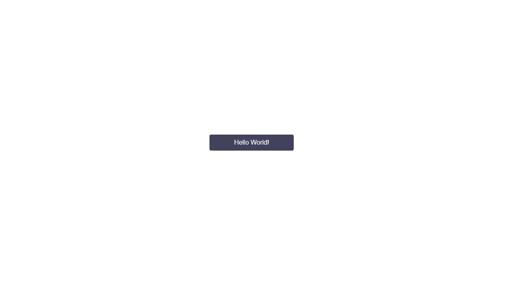

import { Meta, Story, Props, Preview } from '@storybook/addon-docs/blocks';

<Meta title="Readme|Getting-Started" />

# 시작하기

WARD-UIKIT 은 npm 을 통해 제공됩니다.

## 설치하기
다음의 명령어를 통해 UIKIT 과 해당 패키지의 peerDependencies 들을 모두 설치해줍니다.

`npm install --save react-uikit-ward react-spring @emotion/core`

혹은

`yarn add react-uikit-ward react-spring @emotion/core`

위 패키지들의 설치가 끝났다면 UIKIT 을 사용하기 위한 모든 준비가 끝난 것입니다.

## 컴포넌트 import 후 적용

```jsx

import React from 'react';
import './App.css';

import { Button } from 'react-uikit-ward';

const App = () => {
  return (
    <div className="App">
      <Button>Hello World!</Button>
    </div>
  );
};

export default App;
```

